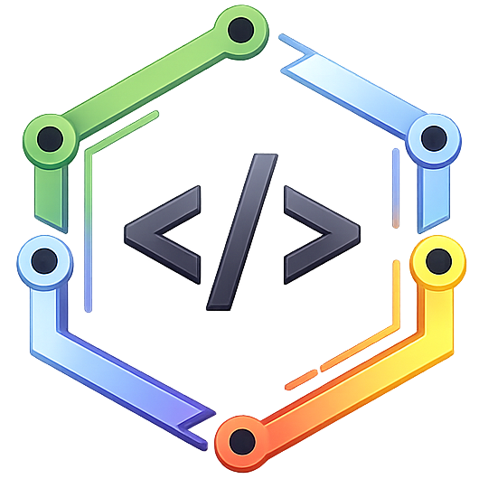

<p align="center">
  
</p>

<h1 align="center">Nexenv</h1>

<p align="center">
  <strong>Workspace manager for developers.</strong><br>
  Stop configuring. Start building.
</p>

<p align="center">
  <a href="https://delixon.dev/nexenv">Website</a> ·
  <a href="https://github.com/delixon-labs/delixon-nexenv/releases">Releases</a> ·
  <a href="docs/cli/CLI_REFERENCE.md">CLI Reference</a> ·
  <a href="LICENSE">License</a>
</p>

---

Nexenv is a cross-platform desktop application that manages development environments per project — fully isolated, fully local, fully private.

One click. Project open. Environment ready.

## Features

- **Project isolation** — each project has its own environment, variables, runtime versions and terminal history
- **Automatic stack detection** — scans your project and identifies languages, frameworks and tools instantly
- **Smart dependency management** — detects what you already have installed and links it instead of duplicating
- **Project templates** — start any project in minutes with the right structure and best practices from day one
- **Portable configuration** — export and import project setups across machines with a single file
- **Health checks** — diagnose missing tools, outdated runtimes and misconfigured environments
- **Instant launch** — one click opens your editor, terminal and environment, all configured correctly

## Stack

| Layer | Technologies |
|-------|-------------|
| Frontend | React 19 · TypeScript · Tailwind CSS |
| Backend | Rust · Tauri 2 |
| Data | SQLite (local) · JSON fallback |
| Platforms | Windows · macOS · Linux |
| Distribution | npm (`nexenv`) · NSIS · MSI |

## Install

### Desktop (recommended)

Download the latest installer from [Releases](https://github.com/delixon-labs/delixon-nexenv/releases).

### CLI via npm

```bash
npm install -g nexenv
nexenv --version
```

## Development

```bash
# Requirements: Node 22+, Rust 1.77+
git clone https://github.com/delixon-labs/delixon-nexenv.git
cd delixon-nexenv
npm install
cp .env.example .env.local
npm run tauri dev
```

### Build installers

```bash
npm run tauri build
```

Output: `src-tauri/target/release/bundle/`

## Documentation

| Document | Description |
|----------|-------------|
| [CLI Reference](docs/cli/CLI_REFERENCE.md) | Complete command-line interface documentation |
| [Manifest Spec](docs/tecnico/MANIFEST_SPEC.md) | Project manifest format specification |
| [Product Plan](docs/producto/PLAN.md) | Product vision and feature roadmap |
| [Roadmap](docs/operativo/ROADMAP.md) | Release timeline and milestones |

## License

Source-available under [FSL-1.1-ALv2](LICENSE). Each version converts to Apache 2.0 two years after release. See [LICENSE-FAQ.md](LICENSE-FAQ.md) for details.

You can use, study, modify and redistribute the code for any purpose **except** building a competing commercial product or service.

---

<p align="center">
  <strong>Nexenv</strong> is a product of <a href="https://delixon.dev">Delixon Labs</a><br>
  <sub>Delixon Labs is the developer tools division of <a href="https://xplustechnologies.com">XPlus Technologies LLC</a></sub><br>
  <sub>© 2026 XPlus Technologies LLC. All rights reserved.</sub>
</p>
